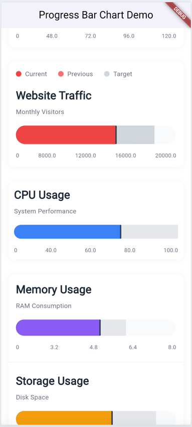
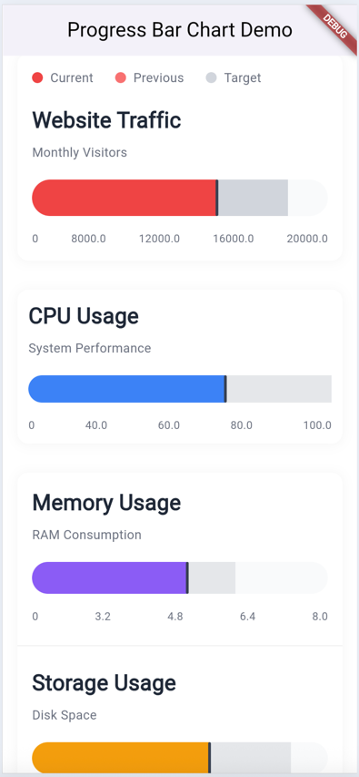
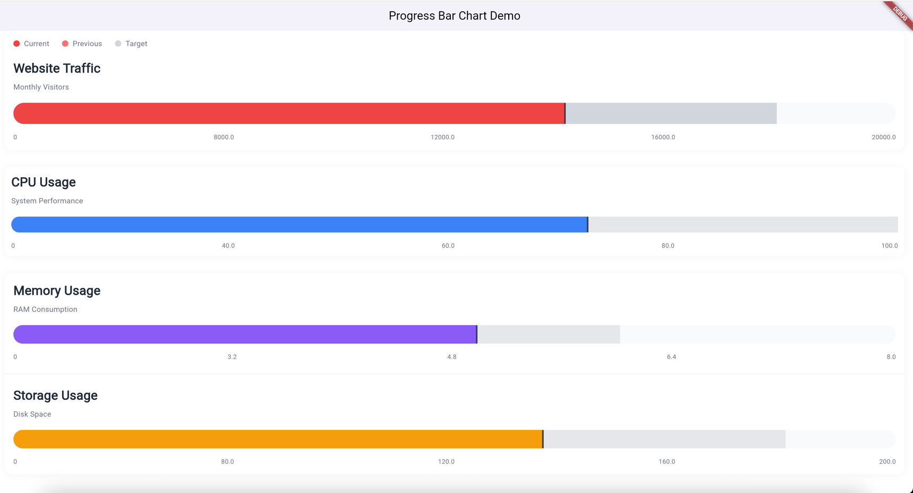

# progress_bar_chart_widget

A Flutter plugin for creating beautiful, customizable progress bar charts with support for multiple data series, legends, and smooth animations.

## Screenshots

| Android | iOS | Web |
|---|---|---|
|  |  |  |

## Features

- Display progress bar charts with current, previous, and average values
- Animated and static chart widgets
- Customizable colors, sizes, legends, and styles
- Supports all major Flutter platforms: Android, iOS, Web, macOS, Windows, Linux
- Easy integration and flexible API

## Installation

Add this to your `pubspec.yaml`:

```yaml
dependencies:
  progress_bar_chart_widget: ^1.0.0
```

Then run:

```sh
flutter pub get
```

## Usage

Import the package:

```dart
import 'package:progress_bar_chart_widget/progress_bar_chart.dart';
```

### Basic Example

```dart
ProgressBarChart(
  data: ChartData(
    title: 'Revenue',
    subtitle: 'US 4, In Thousands',
    currentValue: 2.5,
    previousValue: 3.2,
    averageValue: 4.0,
    maxValue: 5.0,
    unit: 'k',
  ),
)
```

### Animated Example

```dart
AnimatedProgressBarChart(
  data: ChartData(
    title: 'Sales Performance',
    subtitle: 'Monthly Sales Data',
    currentValue: 85,
    previousValue: 70,
    averageValue: 95,
    maxValue: 120,
    unit: '%',
  ),
  animationDuration: Duration(milliseconds: 2000),
)
```

### Customization

You can customize colors, bar height, border radius, legend, and more:

```dart
ProgressBarChart(
  data: ChartData(
    title: 'Website Traffic',
    subtitle: 'Monthly Visitors',
    currentValue: 12500,
    previousValue: 10200,
    averageValue: 15000,
    maxValue: 20000,
  ),
  currentColor: Color(0xFFEF4444),
  previousColor: Color(0xFFF87171),
  averageColor: Color(0xFFD1D5DB),
  backgroundColor: Color(0xFFF9FAFB),
  customLegend: [
    LegendItem(color: Color(0xFFEF4444), label: 'Current'),
    LegendItem(color: Color(0xFFF87171), label: 'Previous'),
    LegendItem(color: Color(0xFFD1D5DB), label: 'Target'),
  ],
  height: 30,
  borderRadius: 15,
  showLegend: true,
  padding: EdgeInsets.all(12),
)
```

### Compact Version

```dart
ProgressBarChart(
  data: ChartData(
    title: 'CPU Usage',
    subtitle: 'System Performance',
    currentValue: 65,
    previousValue: 45,
    averageValue: 80,
    maxValue: 100,
    unit: '%',
  ),
  height: 30,
  borderRadius: 15,
  showLegend: false,
  padding: EdgeInsets.all(12),
  currentColor: Color(0xFF3B82F6),
  previousColor: Color(0xFF93C5FD),
  averageColor: Color(0xFFE5E7EB),
)
```

## API Reference

### ChartData

| Property       | Type     | Description                        |
|---------------|----------|------------------------------------|
| title         | String   | Main title of the chart            |
| subtitle      | String   | Subtitle or description            |
| currentValue  | double   | Current value                      |
| previousValue | double   | Previous value                     |
| averageValue  | double   | Average or target value            |
| maxValue      | double   | Maximum value for the axis         |
| unit          | String   | (Optional) Unit label              |

### ProgressBarChart & AnimatedProgressBarChart

| Property         | Type                | Default                | Description                       |
|------------------|---------------------|------------------------|-----------------------------------|
| data             | ChartData           | -                      | Chart data                        |
| currentColor     | Color               | Indigo (0xFF6366F1)    | Color for current value           |
| previousColor    | Color               | Purple (0xFFA855F7)    | Color for previous value          |
| averageColor     | Color               | Gray (0xFFE5E7EB)      | Color for average value           |
| backgroundColor  | Color               | Gray (0xFFF9FAFB)      | Background color                  |
| height           | double              | 40.0                   | Height of the bar                 |
| borderRadius     | double              | 20.0                   | Border radius of the bar          |
| showLegend       | bool                | true                   | Show/hide legend                  |
| customLegend     | List<LegendItem>?   | null                   | Custom legend items               |
| titleStyle       | TextStyle?          | null                   | Custom title style                |
| subtitleStyle    | TextStyle?          | null                   | Custom subtitle style             |
| padding          | EdgeInsets          | EdgeInsets.all(16.0)   | Padding around the chart          |
| markerWidth      | double              | 3.0                    | Width of the marker line          |
| markerColor      | Color               | Gray (0xFF374151)      | Color of the marker line          |
| animationDuration| Duration            | 1500ms (animated only) | Animation duration                |

## Platform Support

- Android
- iOS
- Web
- macOS
- Windows
- Linux

## Example App

See the [`example/`](example/) directory for a complete app demonstrating all features and customization options.


## License

This project is licensed under the [LICENSE](LICENSE) file. Please add your license.

